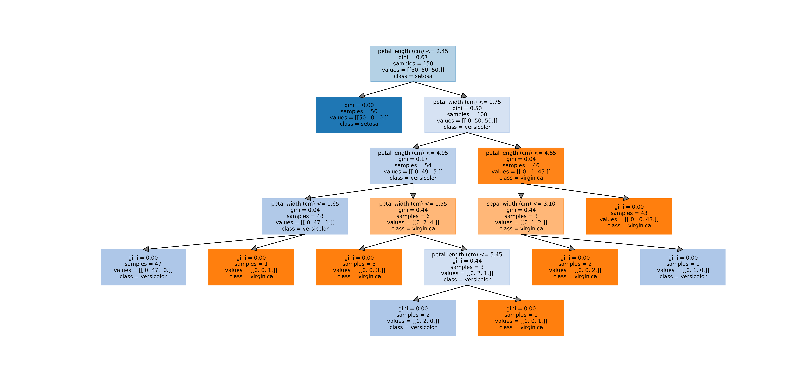
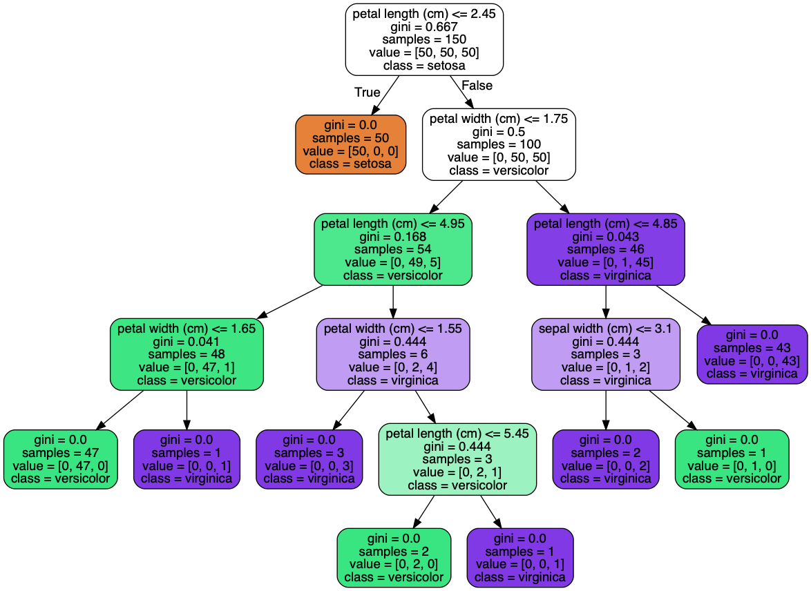
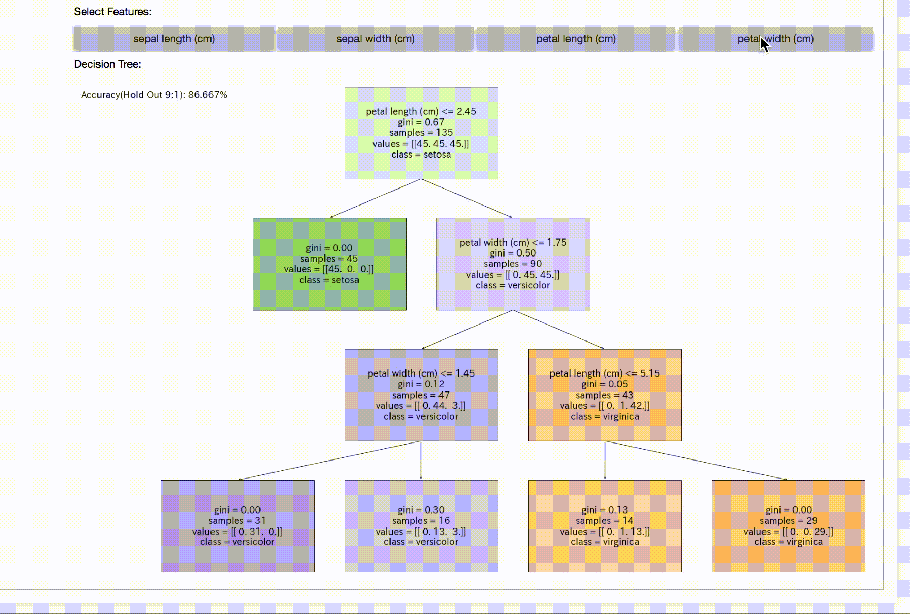

# dtreeplt
it draws Decision Tree not using Graphviz, but only matplotlib.  
If `interactive == True`, it draws Interactive Decision Tree on Notebook using only matplotlib.

## Output Image using proposed method: dtreeplt (using only matplotlib)


## Output Image using conventional method: export_graphviz (Using Graphviz)


## Output Image using dtreeplt Interactive Decision Tree  
  


## Installation
If you want to use the latest version, please use them on git.  
  
`pip install git+https://github.com/nekoumei/dtreeplt.git`

when it comes to update, command like below. 

 `pip install git+https://github.com/nekoumei/dtreeplt.git -U`


Requirements: see requirements.txt    
Python 3.6.X.

## Usage
### Quick Start
```python
from dtreeplt import dtreeplt
dtree = dtreeplt()
dtree.view()
# If you want to use interactive mode, set the parameter like below.
# dtree.view(interactive=True)

```
### Using trained DecisionTreeClassifier
```python
# You should prepare trained model,feature_names, target_names.
# in this example, use iris datasets.
from sklearn.datasets import load_iris
from sklearn.tree import DecisionTreeClassifier
from dtreeplt import dtreeplt

iris = load_iris()
model = DecisionTreeClassifier()
model.fit(iris.data, iris.target)

dtree = dtreeplt(
    model=model,
    feature_names=iris.feature_names,
    target_names=iris.target_names
)
fig = dtree.view()
#if you want save figure, use savefig method in returned figure object.
#fig.savefig('output.png')
```


